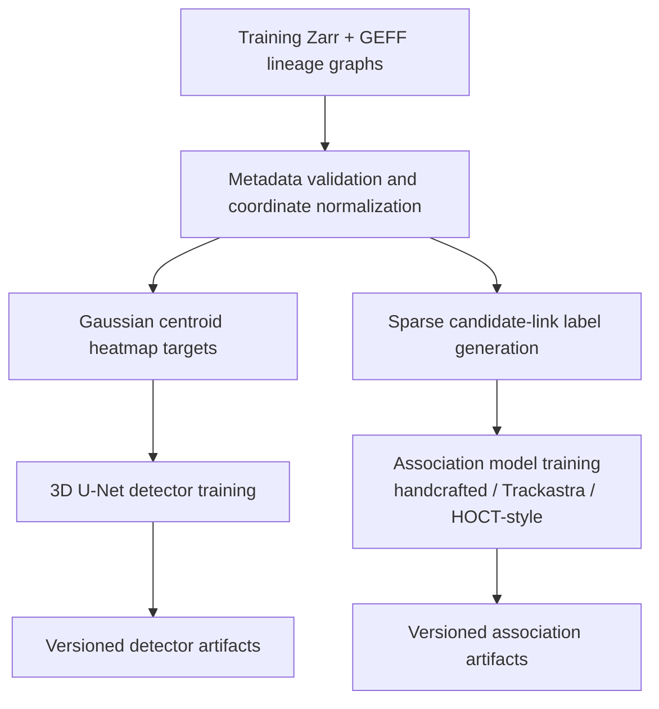
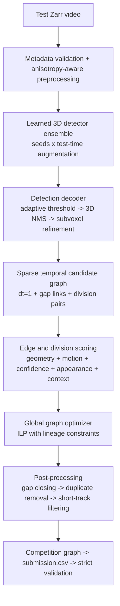

# Learned cell-tracking architecture

This is the target architecture for the project. The competition files and their OME-NGFF/GEFF
metadata remain the source of truth; every spatial threshold is expressed in physical units and is
converted with each dataset's own `voxel_spacing_zyx`.

## Training pipeline



`training.targets.generate_centroid_heatmap` creates anisotropic Gaussian targets using a sigma in
micrometres. `training.labels.label_candidate_graph` assigns continuation and division labels only
where detections have an explicit GEFF-node match; unknown sparse annotations remain `-1` rather
than being silently treated as negatives.

`training.data.CentroidPatchDataset` lazily pairs same-stem training Zarr and GEFF stores, samples
positive-centred 3D patches, and renders targets on demand. `training.detector.train_detector`
trains an encoder-decoder 3D U-Net with BCE-plus-Dice loss, retains the best validation checkpoint,
and exports a sigmoid TorchScript predictor and JSON manifest. `training.association` constructs
sparse events directly from labeled GEFF nodes and fits a class-balanced logistic scorer whose JSON
artifact is loaded by inference. The scorer protocol remains open to richer Trackastra/HOCT-style
adapters.

## Inference pipeline



The optimizer treats a division as one atomic event with two outgoing edges. Its constraints ensure
that a node has at most one incoming parent and emits at most one continuation or division event.
Gap candidates are optimized jointly with one-frame links, rather than greedily added afterwards.

## Package boundaries

| Stage | Module | Contract |
|---|---|---|
| Zarr/metadata | `zarr_reader.py`, `preprocessing.py` | Lazy ZYX frames plus validated physical spacing |
| Training targets | `training/targets.py` | GEFF centroids to float32 heatmaps |
| Training labels | `training/labels.py` | Candidate events to positive/negative/unknown labels |
| Detector training | `training/data.py`, `training/detector.py` | Lazy Zarr/GEFF patches to checkpoint, TorchScript model, and manifest |
| Association training | `training/association.py`, `association/learned.py` | Candidate features to portable learned event scorer |
| Learned detection | `detection/ensemble.py` | Framework-neutral `HeatmapPredictor` protocol |
| Decoding | `detection/decoder.py` | Heatmaps to subvoxel `DetectionCandidate` values |
| Candidate graph | `association/candidates.py` | Sparse links, gaps, and division pairs |
| Scoring | `association/scoring.py` | In-place event scores; replaceable by learned scorer |
| Optimization | `association/optimizer.py` | Consistent selected node-index edges |
| Post-processing | `postprocessing.py` | Deduplicated, optionally filtered prediction graph |
| Export | `submission/` | Exact competition schema and strict validation |

`pipeline.run_prediction_pipeline` is the composition root. It accepts injected heatmap predictors
for tests or research adapters and otherwise loads TorchScript detector artifacts with overlapping
sliding-window inference from the config.
The existing blob detector is retained as `detection.method: blob`; it enters the same candidate,
scoring, optimization, post-processing, and export stages, so it remains a useful smoke-test and
fallback without defining the architecture.

## Configuration and artifacts

`configs/training.yaml` controls U-Net and association fitting. `configs/architecture.yaml` contains
the learned inference pipeline shape. Artifact paths are explicit; a learned run fails early if
they are absent. Numerical thresholds are starting hypotheses until cross-validation against the
training Zarr/GEFF pairs records tuned artifacts.

Train artifacts with:

```powershell
python -m pip install -e ".[dev,ml]"
biohub-track train-detector-ensemble --competition-root data/competition --config configs/training.yaml
biohub-track train-association --competition-root data/competition --config configs/training.yaml
biohub-track run --competition-root data/competition --config configs/architecture.yaml
```

The learned linear association scorer and deterministic geometric reference scorer both implement
`CandidateGraphScorer`. A future Trackastra- or HOCT-style adapter can populate the same event scores
without changing candidate generation, global optimization, or export.
